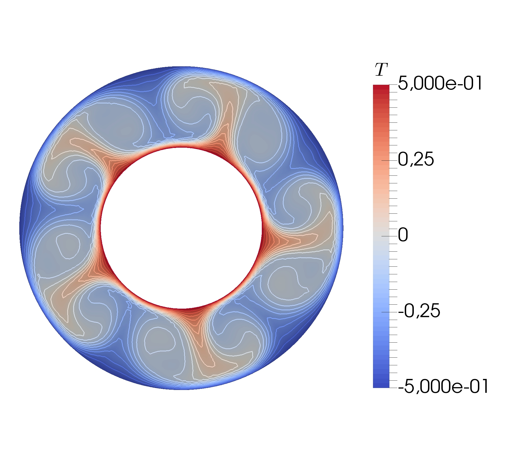
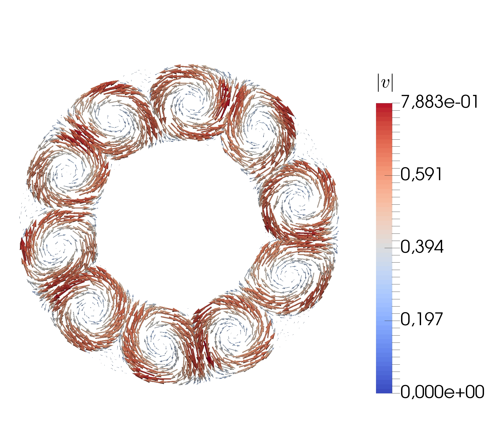

# Core-Convection
This repository provides several implementations of the Finite-Element-Method (FEM) for solving common problems in continuum mechanics. The underlying partial differential equations (PDEs) are solved utilizing the popular open-source platform [FEniCS](https://fenicsproject.org/). All codes were written as part of my [bachelor thesis](https://github.com/b-turan/core-convection/blob/master/Bachelor-Thesis-Turan.pdf) "Numerical Modeling and Simulation of Convection in Earth's Outer Core via Finite Element Method". The thesis incorporates a thorough derivation of each problem and its (strong and weak) formulations.  

The programs range from simple introductory problems such as the cavity flow to more advanced problems like the 2-dimensional mantle/core convection. The latter was realized by linking the Navier-Stokes-Equation with the Heat Equation using the Boussinesq-approximation (see thesis for detailed derivation). Furthermore, the derived PDEs were discretized with advanced numerical approaches, e.g. the [implicit-explicit-scheme](https://epubs.siam.org/doi/abs/10.1137/0732037) (IMEX, 2nd order), which is a multistep time-discretization scheme. Performances with respect to accuracy were analyzed on benchmark problems.

Temperatur             |  Velocity
:-------------------------:|:-------------------------:
  |  

## Remark
The code was not intended for the public and was therefore not implemented according to specific coding standards. 
